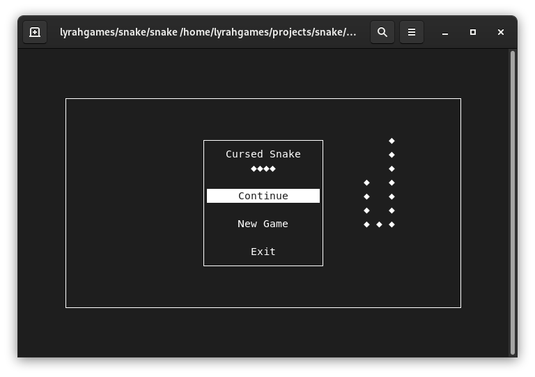

# C++ Basics: Cursed Snake

Simple Snake Variant Written in Ncurses and Playable in the Shell

This code shall be used as a base for further learning the basics of C++ programming.

## Author
- Markus Pawellek "lyrahgames" (lyrahgames@mailbox.org)

## Requirements
- Language Standard: C++17
- Operating System: Linux
- Compiler: GCC | Clang
- Build System: [build2](https://build2.org)
- NCURSES

## Usage

- Space: Toggle Pause Menu
- Arrow Keys: Control Snake in Game or Selection in Menu
- Enter: Activate Selected Menu Entry
